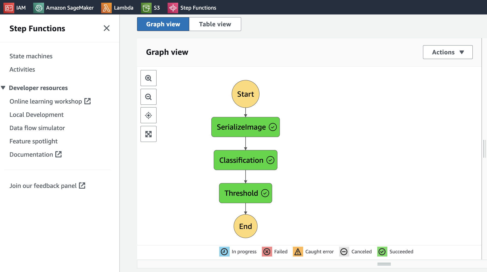
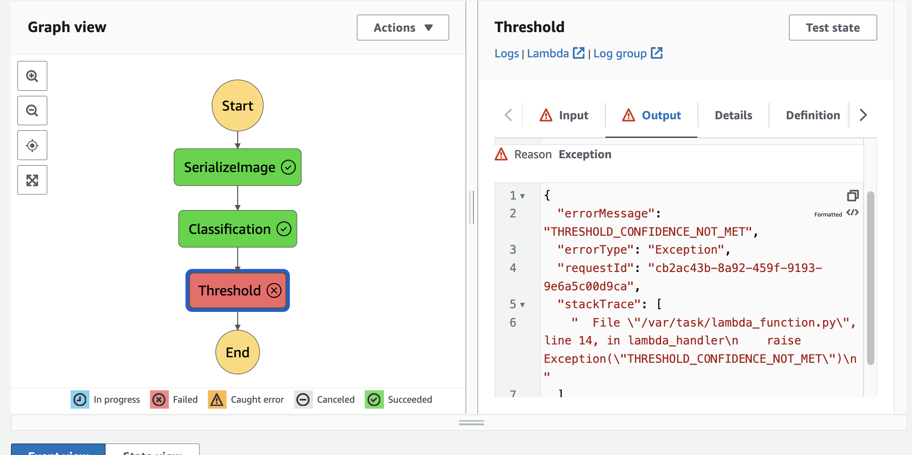

# Deploy and monitor a machine learning workflow for Image Classification
This repository contains my project files for an AWS Machine Learning Nanodegree assignment at Udacity, which focuses on orchestrating AWS Lambda functions with AWS Step Functions to perform image processing tasks.

## Project Overview

This project demonstrates the use of AWS Step Functions to manage a serverless workflow where images are processed through a series of Lambda functions. Each step in the process involves different tasks such as serialization of image data, classification through a machine learning model, and applying a threshold to filter results based on confidence levels.

## Workflow Diagrams

### Working Step Function


### Threshold Not Met Error


## Components

- `definition.json`: JSON file that defines the structure of the Step Function workflow.
- `lambda.py`: Contains the code for the AWS Lambda functions used in the workflow.
- `starter.ipynb`: Jupyter notebook provided as a starter code for setting up and testing the project.
- `screenshots/`: Folder containing images of the Step Function in both successful and error states.

## How It Works

1. **Serialize Image**: This Lambda function prepares the image data for processing.
2. **Classification**: Performs classification on the serialized image using a machine learning model.
3. **Threshold**: Applies a confidence threshold to the classification results; if the results do not meet the threshold, an error is raised.

The function flow is managed by AWS Step Functions, ensuring that each step is executed in the correct order and handling any errors that occur.

## Technologies Used

- AWS Lambda
- AWS Step Functions
- Python
- Jupyter Notebooks

## Setup

To run this project, clone the repository and set up the AWS services:

```bash
git clone https://github.com/[your-username]/aws-step-functions-image-processing.git
cd aws-step-functions-image-processing
# Follow the setup instructions in `starter.ipynb` to deploy the Lambda functions and create the Step Function.
